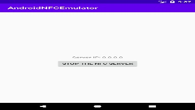

# AndroidNFCEmulator

Testing NFC-based Android apps can sometimes be a little frustrating, especially if you don't have access to a physical device, tags, or even if you just want to use the emulator to test out a couple different device configurations.

In an attempt to remedy this, AndroidNFCEmulator lets you fake the intent produced by Android when a tag is scanned via a simple HTTP request. Currently, it can only simulate NDEF-formatted tags with a single URI record, but expanding it to encompass multiple records and different formats shouldn't be difficult.

## Setup
Download or clone the source, open it in Android Studio, build it, and install it on your target device. Open the app, and start the service. It's at this point that you'll need to determine how to talk to your device.

- On a real device, the IP address show on-screen will (probably) accurately reflect your device's IP address, and can be used as such.
- On the Android emulator, due to the configuration of the virtual router within the emulator's networking setup, you won't be able to directly talk to it without an extra step. Using ADB, you can port-forward port 8080 of the emulator (the default port used) to port 8080 of your own computer with `adb forward tcp:8080 tcp:8080`, and use `localhost` or `127.0.0.1` as the IP.

## Use
Once you have the service running, simply make a HTTP GET request of the format `http://<your-ip-address>/?uri=<your-uri>` (e.g. `http://192.168.1.27/?uri=https://google.com`). The service will then dispatch an `ACTION_NDEF_DISCOVERED` intent with the data parameter set to the provided URI (and with `EXTRA_NDEF_MESSAGES` set accordingly), hopefully to your app!

## Shortcomings / TODO
- As mentioned above, AndroidNFCEmulator can only currently emulate NDEF URI tags with a single record.
- Only the data URI and `EXTRA_NDEF_MESSAGES` are passed in the intent - `EXTRA_TAG` is **not** passed to the receiving application!
